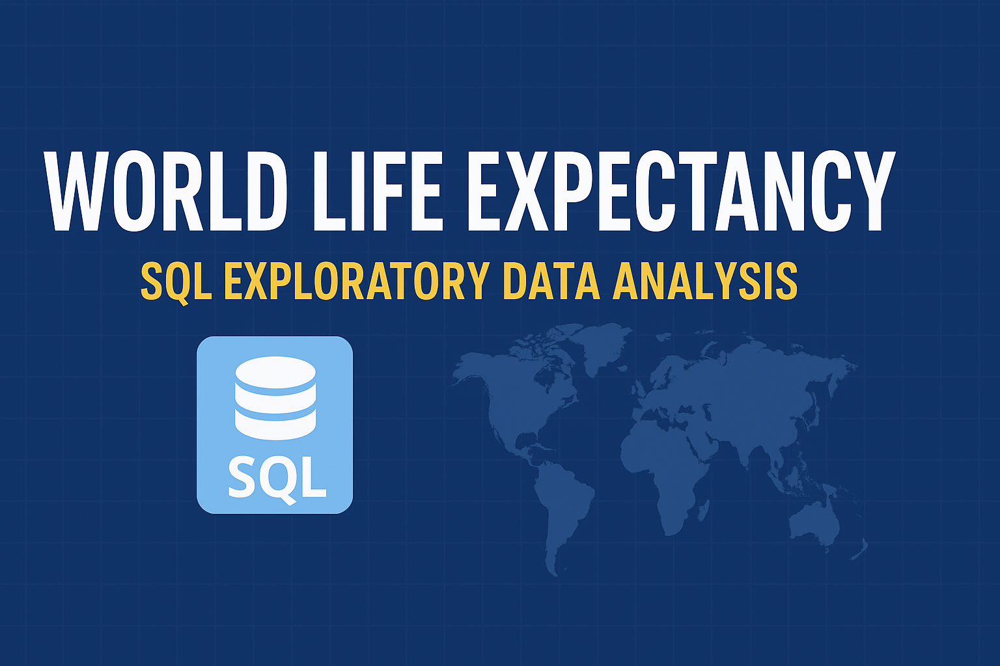

## 📌 Project Overview
This project explores **World Life Expectancy data** using **SQL**.  
The goal was to analyze health and economic factors such as **GDP, BMI, Adult Mortality**, and how they influence **life expectancy** across countries.  

Through SQL queries, I uncovered patterns and relationships between different variables and tracked changes in life expectancy over time.  

---

## 🗂 Dataset
- Table Name: `world_life_expectancy`
- Columns include:
  - `Country`
  - `Year`
  - `LifeExpectancy`
  - `GDP`
  - `BMI`
  - `Status` (Developing / Developed)
  - `AdultMortality`

---

## 🛠️ SQL Techniques Used
- **Data Cleaning** → Removed rows where `LifeExpectancy = 0`
- **Aggregations** → `MIN()`, `MAX()`, `AVG()`, `ROUND()`
- **Grouping & Filtering** → `GROUP BY`, `HAVING`, `WHERE`
- **Window Functions** → `SUM() OVER(PARTITION BY ...)`
- **Trend Analysis** → Yearly average life expectancy

---

## 🔎 Key Analyses
1. **Minimum & Maximum Life Expectancy per Country**  
   - Identified data issues (0 values) and cleaned them.  
   - Found which countries made the **biggest improvements** in life expectancy.  

   ```sql
   SELECT country,
          MIN(Lifeexpectancy) AS Min_LE,
          MAX(Lifeexpectancy) AS Max_LE,
          ROUND(MAX(Lifeexpectancy)-MIN(Lifeexpectancy),0) AS Increased_Years
   FROM world_life_expectancy
   GROUP BY country
   HAVING MIN(Lifeexpectancy) <> 0 AND MAX(Lifeexpectancy) <> 0
   ORDER BY Increased_Years DESC;
Global Life Expectancy Trend by Year

Calculated average life expectancy per year.

Found an overall increase of ~6 years globally.

sql
Copy
Edit
SELECT year,
       ROUND(AVG(Lifeexpectancy),2) AS Avg_Life_Expectancy
FROM world_life_expectancy
WHERE Lifeexpectancy <> 0
GROUP BY year
ORDER BY year DESC;
Correlation between GDP and Life Expectancy

Countries with higher GDP generally showed higher life expectancy.

sql
Copy
Edit
SELECT country,
       ROUND(AVG(Lifeexpectancy),1) AS life_exp,
       ROUND(AVG(GDP),1) AS avg_gdp
FROM world_life_expectancy
GROUP BY country
HAVING life_exp <> 0 AND avg_gdp <> 0
ORDER BY avg_gdp DESC;
Life Expectancy by Development Status

Compared developing vs developed countries.

sql
Copy
Edit
SELECT status,
       COUNT(DISTINCT country) AS country_count,
       ROUND(AVG(Lifeexpectancy),1) AS avg_LE
FROM world_life_expectancy
GROUP BY status;
BMI vs Life Expectancy

Explored correlation between average BMI and life expectancy.

sql
Copy
Edit
SELECT country,
       ROUND(AVG(Lifeexpectancy),1) AS LE,
       ROUND(AVG(BMI),1) AS BMI
FROM world_life_expectancy
GROUP BY country
HAVING LE > 0 AND BMI > 0
ORDER BY BMI DESC;
Adult Mortality - Rolling Totals

Tracked cumulative adult mortality per country over time.

sql
Copy
Edit
SELECT country,
       Year,
       Lifeexpectancy,
       AdultMortality,
       SUM(AdultMortality) OVER(PARTITION BY country ORDER BY year) AS Rolling_total
FROM world_life_expectancy;
📊 Key Findings
🌍 Global life expectancy increased by ~6 years in recent decades.

💰 Countries with higher GDP generally have longer life spans.

⚖️ Balanced BMI levels are linked to better life outcomes.

☠️ Adult mortality trends show ongoing health challenges in some regions.

📈 Some countries made huge improvements in life expectancy over time.

📂 Project Structure
bash
Copy
Edit
📁 World-Life-Expectancy-EDA
│── 📄 World Life Expectency(EDA).sql   # SQL queries
│── 📄 README.md                        # Project documentation
🚀 How to Use
Import the dataset into your SQL environment.

Run the queries provided in World Life Expectency(EDA).sql.

Explore results to gain insights into global health trends.

📌 Author
👤 Nayem Mia
